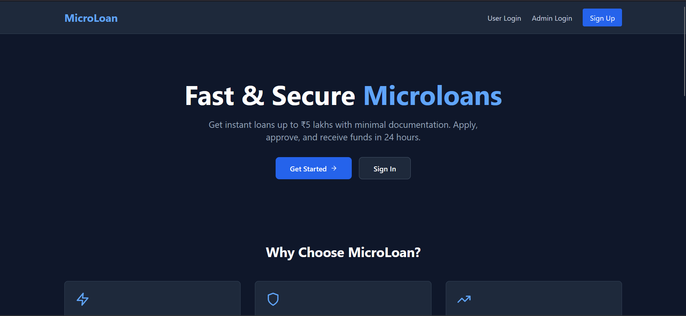
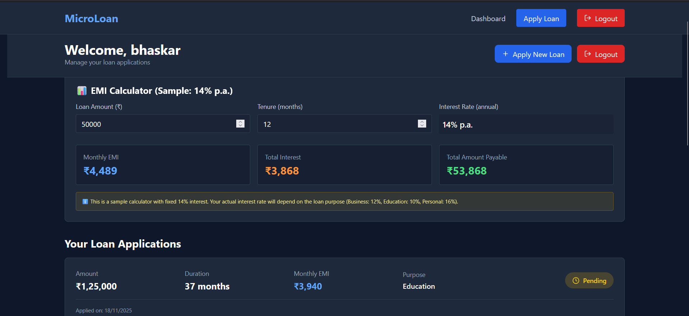
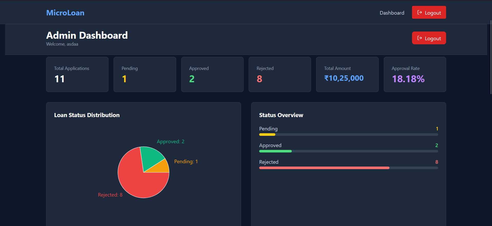
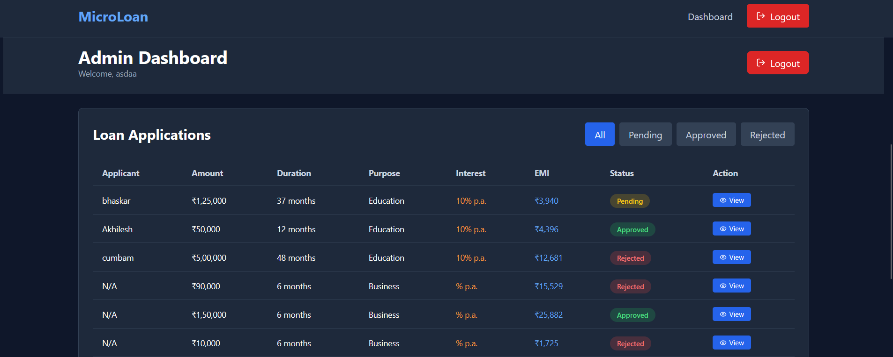

# 🏦 Microloan Platform

A full-stack MERN application for managing microloans with instant EMI calculation and admin workflows.

## ✨ Features

✅ User registration & JWT authentication  
✅ Real-time EMI calculator  
✅ Loan application tracking  
✅ Admin approval dashboard  
✅ Email notifications  
✅ Responsive design  

## 🛠️ Tech Stack

**Frontend:** React 18, Vite, Tailwind CSS, Chart.js  
**Backend:** Node.js, Express, MongoDB, Mongoose  
**Auth:** JWT, Bcrypt  

## 📸 Screenshots

### Home Page


### User Dashboard


### Admin Dashboard


### Admin Dashboard Analytics


## 🚀 Quick Start

### Backend Setup
```bash
cd server
npm install
cp .env.example .env
# Update MONGO_URI, JWT_SECRET in .env
npm run dev
```

### Frontend Setup
```bash
cd client
npm install
npm run dev
```

Open `http://localhost:5173`

## 🔐 Default Admin Credentials
```
Email: admin@microloan.com
Password: admin123456
```

## 📁 Project Structure
```
microloan-platform/
├── client/               # React frontend
├── server/               # Express backend
├── assets/              # Screenshots folder
└── README.md
```

## 🔌 Key API Endpoints
```
POST   /api/auth/signup       - Register user
POST   /api/auth/login        - User login
POST   /api/loans/apply       - Apply for loan
GET    /api/admin/loans       - Get all loans (admin)
PUT    /api/admin/loans/:id   - Approve/reject loan
```

## 📝 License
MIT

---
**Made with ❤️ by Akhilesh Chandaluri**